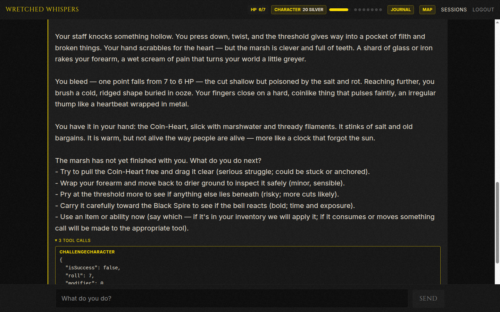
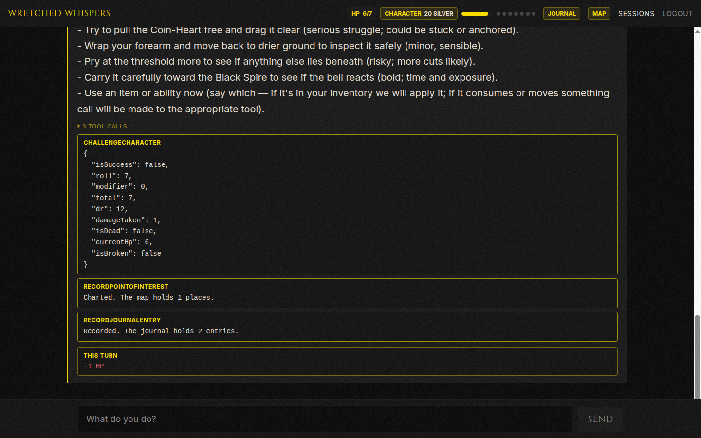
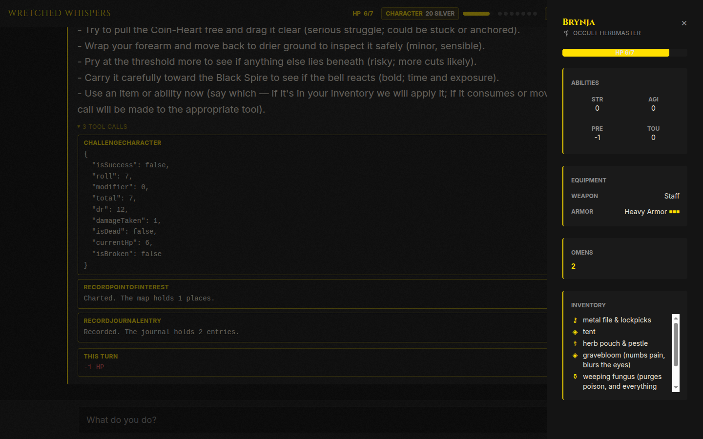
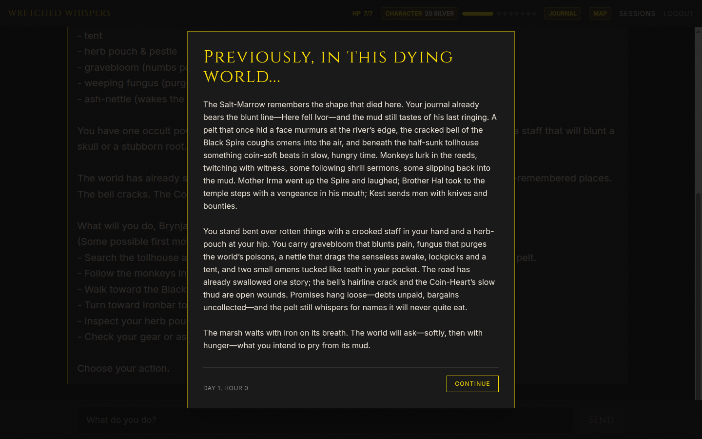

# 

# ABOUT

An experiment in fusing AI Agents with an Expert System to emulate the doomed world of MÖRK BORG.

In practice: a solo MÖRK BORG campaign in your browser, run by an AI game master that narrates but never cheats —
one `docker run` and you're playing.

The rules draw primarily from the MÖRK BORG core book, though some have been bent, broken, or simplified in the name of
playability (for now). Treat this system as a tool, a toy, or a trap — use it at your own discretion.

Remember: the world is never more than seven Miseries away from its inevitable end. Every roll, every scar, every broken
body brings the apocalypse closer.

Play with it, or play against it.
Play if you dare.

---

# What playing it looks like

You type what you do. The domain rolls the dice, takes your hit points, and charts the map; the narrator finds the
words for it.



Every turn ships with its receipt. Expand the tool calls under any narration and read the actual roll, the DR it
failed against, the damage the domain applied. The prose cannot lie about what happened, because it didn't decide
what happened.



The character sheet, journal, and map are views over domain state, and returning to a session gets you a
"previously on..." recap distilled from everything that actually occurred.

| | |
|---|---|
|  |  |

---

# What this actually is

A C# domain engine that knows the rules, wrapped in an LLM that knows how to describe a death.

The split is the whole point. **The domain owns every fact** — hit points, silver, inventory, dice, the Calendar of
Nechrubel, whether you are dead. **The model owns the prose, and nothing else.** It cannot decide you lost 4 HP; it can
only ask a tool to hurt you and then find the words for it. A language model will happily narrate a purchase you never
made with total confidence, and the player believes the prose, not the database. So the prose is never allowed to be the
record.

- **`wretched-whispers-server/`** — .NET 10 solution: domain, persistence, agent engine, HTTP API.
- **`wretched-whispers-web/`** — Next.js 16 / React 19 SPA, static-exported and served by the API in every release build.
- **`docs/`** — the reasoning, the migration policy, the eval harness.

---

# Run it

## Docker (the fastest way to get killed)

The default image is the single-user `StandaloneContainer` profile. No login, SQLite and settings in `/data`.

```bash
docker run -p 127.0.0.1:8080:8080 -v ww-data:/data -e OPENAI_API_KEY=sk-... ghcr.io/arst/wretched-whispers
```

Open <http://localhost:8080> and play. Or run with no key and paste it in the browser on first run:

```bash
docker run -p 127.0.0.1:8080:8080 -v ww-data:/data ghcr.io/arst/wretched-whispers
```

| Env var | Meaning | Default |
|---|---|---|
| `OPENAI_API_KEY` | Your OpenAI-compatible API key | unset → first-run screen asks |
| `OPENAI_MODEL` | Chat model | `gpt-4o` |
| `OPENAI_BASE_URL` | OpenAI-compatible gateway (e.g. OpenRouter) | OpenAI |
| `WW_DATA_DIR` | Where SQLite + `settings.json` live | `/data` in the image |

Environment beats `settings.json` beats the first-run UI: when `OPENAI_API_KEY` is set on the container it always wins
over a key saved in the browser, including after a restart.

Azure OpenAI works through its OpenAI-compatible endpoint — set `OPENAI_BASE_URL` to
`https://<resource>.openai.azure.com/openai/v1` and `OPENAI_MODEL` to your deployment name.

The container serves plain HTTP on port 8080. Put Caddy/Traefik/nginx in front if you expose it beyond your machine;
the apocalypse is scheduled, a plaintext API key on the open internet doesn't need to be.

## Locally, from source

**You need:** .NET 10 SDK, Node 22+, and an OpenAI-compatible API key.

```bash
./dev.sh              # API on :5007 + Next dev server on :3000 (Ctrl-C stops both)
./dev.sh --api-only   # or --web-only
```

Then open <http://localhost:3000>. `dev.sh` builds the default `Server` profile in Development, which means Identity
auth is on — register an account on the login screen. Leave `NEXT_PUBLIC_DEPLOYMENT_PROFILE` unset; the Next dev server
reads `NEXT_PUBLIC_API_URL` from `wretched-whispers-web/.env.local` (see `.env.example`) and talks cross-origin to
:5007, which is the one and only configuration where CORS is enabled.

In Development with SQLite the API applies pending migrations at startup, so a local database can never fall behind the
code. PostgreSQL is never migrated by the API — see [docs/database-migrations.md](docs/database-migrations.md).

**Giving the API a key.** The `Server` profile leaves `Llm:Provider` unset, which means **Azure OpenAI** — the hosted
deployment's provider. Development loads user secrets, so:

```bash
cd wretched-whispers-server/WretchedWhispers.Api
dotnet user-secrets set "AzureOpenAiSettings:Endpoint" "https://<resource>.openai.azure.com/"
dotnet user-secrets set "AzureOpenAiSettings:ApiKey" "..."
dotnet user-secrets set "AzureOpenAiSettings:ChatModelDeployment" "<deployment-name>"
```

To use plain OpenAI (or any compatible gateway) locally instead, switch the provider and set the `Llm:*` keys:

```bash
dotnet user-secrets set "Llm:Provider" "openai"
dotnet user-secrets set "Llm:ApiKey" "sk-..."
dotnet user-secrets set "Llm:Model" "gpt-4o"
# dotnet user-secrets set "Llm:BaseUrl" "https://openrouter.ai/api/v1"
```

With `Llm:Provider=openai` set, the container env vars `OPENAI_API_KEY` / `OPENAI_MODEL` / `OPENAI_BASE_URL` work here
too — they map onto `Llm:*` as the last configuration layer, so they beat everything else. Credentials are validated on
first use rather than at startup: a keyless `dotnet run` still boots, the UI still loads, and every turn fails with a
readable message. Thematically appropriate, practically useless.

> Run the API with plain `dotnet run`, not `--no-launch-profile`. The launch profile supplies both the Development
> environment and the :5007 binding; drop it and every turn returns a 500 dressed up as a CORS error.

**Tests:**

```bash
dotnet test wretched-whispers-server/WretchedWhispers.slnx  # domain, engine, endpoints, migrations
cd wretched-whispers-web && npm test                        # vitest, jsdom
```

Live LLM evals live in `WretchedWhispers.Evals` and skip cleanly without credentials — see
[docs/running-evals.md](docs/running-evals.md).

## Desktop

```bash
./build-desktop.sh [rid]     # linux-x64, win-x64, osx-arm64, ...
```

Static-exports the SPA into `wwwroot`, then publishes a single-file self-contained binary with a Photino native shell.
Output lands in `dist/<rid>`. Bring your own key; the database goes in the OS app-data directory.

---

# Architecture

## The layers

```
Core  ←  Infrastructure  ←  Engine  ←  Api
```

Strictly one direction. Nothing downstream leaks upstream.

| Project | What lives there |
|---|---|
| `WretchedWhispers.Core` | The expert system. Sealed domain entities — `Character`, `Campaign`, `Encounter`, the Calendar of Nechrubel, Miseries, Omens, dice, classes, armour tiers, combat resolution. Zero AI, zero EF, zero HTTP. |
| `WretchedWhispers.Infrastructure` | EF Core persistence, repositories, dual SQLite/PostgreSQL contexts and migration sets, the turn queue and event store, `ISessionLock`. |
| `WretchedWhispers.Engine` | The AI half: game tools, stage prompts, the narrator persona, `TurnCoordinator`, `AgentExecutor`, history reduction, output scrubbing, tracing. A class library on purpose — a native client can host a game in-process via `AddGameAgent` + `TurnCoordinator` with no HTTP anywhere. |
| `WretchedWhispers.Api` | ASP.NET Core minimal APIs, Identity or local auth depending on profile, SSE turn streaming, health checks, and the static SPA. |
| `WretchedWhispers.Migrations` | Standalone migration runner. Takes an advisory lock, logs applied/pending IDs, safe to rerun. Runs before a new revision takes traffic. |
| `WretchedWhispers.Tests` / `.Evals` | xUnit unit + endpoint tests; live LLM evals with an on-disk response cache. |

## The life of a turn

1. `POST /api/sessions/{id}/turns` validates the message, deduplicates on a client-supplied `RequestId`, enqueues a
   turn row, and returns `202 Accepted` immediately. The HTTP request does not wait for a model that may think for
   minutes.
2. `TurnWorker` (a `BackgroundService`) claims the turn under a renewable lease. A lease that expires means the owner
   actually died, not that the model was slow; whoever reclaims it decides the outcome.
3. `TurnCoordinator` takes the session lock, loads `SessionContext`, **derives** the stage, and runs the turn inside a
   single unit of work.
4. `AgentToolProvider` builds the agent with *only* the tools that stage allows. `PromptComposer` assembles the persona,
   the stage prompt, and a formatted state snapshot.
5. `AgentExecutor` streams the run on Microsoft Agent Framework, mapping model output to `GameTurnEvent`s — narration
   plus tool results.
6. Events are appended to a store, and the client tails them over SSE at `GET /api/turns/{id}/events`, resuming from
   `Last-Event-ID`. Close the laptop mid-turn; reopen it and the corpse is still warm.

## The stage machine

Six stages: `CharacterCreation`, `CampaignSetup`, `Exploration`, `Combat`, `Resolution`, `Ended`.

The model does not choose the stage. `SessionContext.DeriveStage()` computes it from state, every turn, in a fixed
priority order: dead character or ended world → `Ended`; no character → `CharacterCreation`; campaign not active →
`CampaignSetup`; a started, unfinished encounter → `Combat`; and so on. There is no transition to get wrong, because
there is no transition — only a function of the current facts.

Session status is likewise derived. The single exception is `fallen`: the stage is `Ended`, but the death is
recoverable — bury the wretch, roll another. The world ending is not recoverable. It never was.

---

# Technical decisions, and why

**The domain is the only writer of truth.** Every state change goes through a domain method: dice roll in the domain,
combat resolves one full round per player action in the domain, the dawn die belongs to difficulty settings, not the
narrator. Ask of any state: *can the model change this by saying it changed?* If yes, that is a fabrication vector, and
it gets closed. Full reasoning in [docs/ai-system-design-lessons.md](docs/ai-system-design-lessons.md).

**Tools are stage-scoped at construction, not filtered at call time.** `GameToolCatalog` reflects `[GameTool]`
attributes once at startup into a frozen stage → tool map; `AgentToolProvider` then builds each turn's agent with only
that stage's tools bound. An out-of-stage action isn't rejected — it is *unreachable*, because the function was never
handed to the model. Architecture where architecture can enforce it, prompt only where it can't. Adding a tool means
adding one attributed method in one file.

**Narration before the first tool call is discarded.** If the model calls any tool during a turn, only prose emitted
*after* that call is trusted and shown. Text produced beforehand is the model describing an outcome it hasn't asked for
yet — the exact shape of a fabricated result. Belt, braces, and a `OutputScrubber` that strips raw GUIDs the persona was
already told never to speak aloud.

**Tool argument guards talk to the model, not the log.** `ToolGuard` messages are written to be *read by the model*:
Agent Framework feeds the validation failure back so the call can be corrected, instead of a bad argument exploding deep
in the domain and killing the whole turn.

**Retries live at the transport, never around the agent run.** The chat client retries an individual model HTTP request
on 408/429/5xx/network errors with exponential backoff, bounded by a network timeout. Retrying the *agent loop* would
be catastrophic: it executes state-mutating tools inside the turn's transaction, so a second pass would apply them
twice. Retrying one request never re-runs a tool whose result is already in the conversation.

**Long sessions get summarized, not truncated.** `ChatHistoryReducer` folds older messages into a single system message
that preserves game state and tone, keeping the recent tail verbatim. The full history stays in the database; only the
model's working context is bounded.

**Deployment profiles are compile-time constants, not runtime flags.** `-p:DeploymentProfile=Server|StandaloneContainer|Desktop`
sets a `DefineConstants` symbol. The Desktop profile is the only build that compiles `Desktop/**` or references
Photino; the standalone builds don't carry Identity's cookie surface. An invalid profile fails the build via an MSBuild
target rather than surfacing as a confusing 404 at runtime. CI compiles all three on every push.

**Auth differs by profile because the threat model differs.** Hosted `Server` uses ASP.NET Identity with bearer tokens,
strict-SameSite cookies, antiforgery on state-changing endpoints, forwarded headers, and per-user rate limiting on
turns (a turn costs a model call) plus per-IP limiting on auth. The standalone profiles authenticate every request
through `LocalAuthHandler` — there is no ambient credential for a third party to ride, so CSRF protection would be
guarding nothing. Settings endpoints still sit behind the authenticated group in every profile: the standalone
container binds `0.0.0.0`, and an unauthenticated `POST` there could repoint `Llm:BaseUrl` at someone else's server and
redirect every prompt.

**One error contract.** `AddProblemDetails` + `UseExceptionHandler` + `UseStatusCodePages`, so RFC 9457 covers our
handlers, framework 401/404/429s, and unhandled exceptions alike — instead of an ad-hoc `{"error": ...}` shape next to
bodiless 500s.

**SQLite by default, PostgreSQL when there is more than one of you.** `WW_DB_PROVIDER=postgres` swaps the context and
replaces the in-memory session guard with a Postgres advisory transaction lock, and data-protection keys move into the
database. Both providers keep their own migration sets, so a model change needs both. Schema changes follow
expand / roll out / contract, and the API role never owns the schema — DDL credentials belong to the migration job
alone.

**Prompt fixes ship with evals.** Every failure worth fixing in a prompt becomes a scenario in `WretchedWhispers.Evals`,
with model responses cached on disk so unchanged scenarios re-run for free. A guardrail with no eval is a guardrail
that quietly stops working.

**The narrator is instrumented.** OpenTelemetry spans cover the turn pipeline and tool calls; turn traces are persisted
and exportable. When the game master lies, you can go and read exactly how.

---

# Deployment profiles

| Profile | Build | Runtime |
|---|---|---|
| `Server` | `docker build --build-arg DEPLOYMENT_PROFILE=Server -t wretched-whispers:server .` | Identity, PostgreSQL-ready API, bundled UI; no writable volume required |
| `StandaloneContainer` | `docker build -t wretched-whispers:standalone .` | Local user, settings UI, SQLite in `/data` |
| `Desktop` | `./build-desktop.sh [rid]` | Local user, settings UI, SQLite in OS app-data, Photino window |

All release profiles set `NEXT_PUBLIC_DEPLOYMENT_PROFILE` and bundle the static export into the ASP.NET app.
Application endpoints live under `/api`; health probes at `/health/live` and `/health/ready`.

Every commit on `main` publishes its `Server` image to `ghcr.io/arst/wretched-whispers-server:<commit-sha>` — tagged by
SHA alone, deliberately, because a moving tag leaves the container app's image string unchanged and an unchanged
template produces no new revision. The hosted deployment that consumes it is driven from a separate private repository,
so nothing here needs cloud credentials. Tagged `v*` releases publish the multi-arch standalone image.

---

# Further reading

- [docs/ai-system-design-lessons.md](docs/ai-system-design-lessons.md) — the reasoning behind every guardrail above, written to be re-read before building the next AI system.
- [docs/database-migrations.md](docs/database-migrations.md) — expand / roll out / contract, and what a destructive migration PR must state.
- [docs/running-evals.md](docs/running-evals.md) — credentials, the response cache, and rendering the HTML report.

---

# License

The code in this repository is licensed under [Apache-2.0](LICENSE). Mörk Borg-related content (rules terminology,
setting names) is used under the MÖRK BORG Third Party License — see the disclaimer below.

---

# DISCLAIMER

Wretched Whispers is an independent production by Artem Startsev and is not affiliated with Ockult Örtmästare Games or
Stockholm Kartell. It is published under the MÖRK BORG Third Party License. MÖRK BORG is copyright Ockult Örtmästare
Games and Stockholm Kartell.
